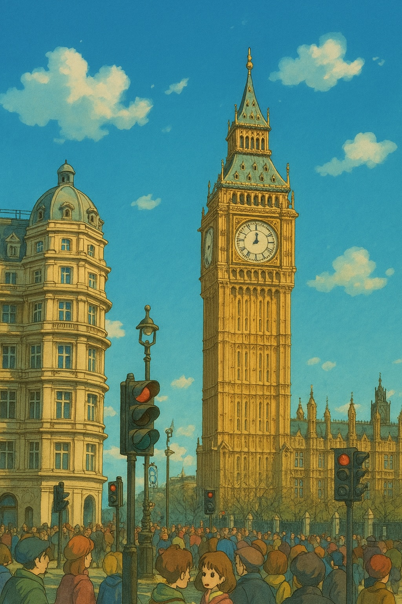
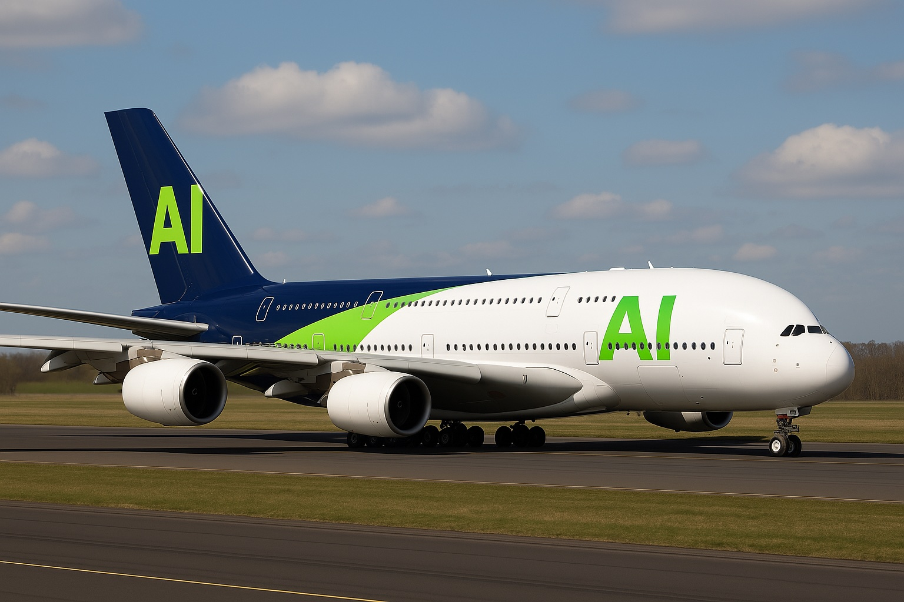
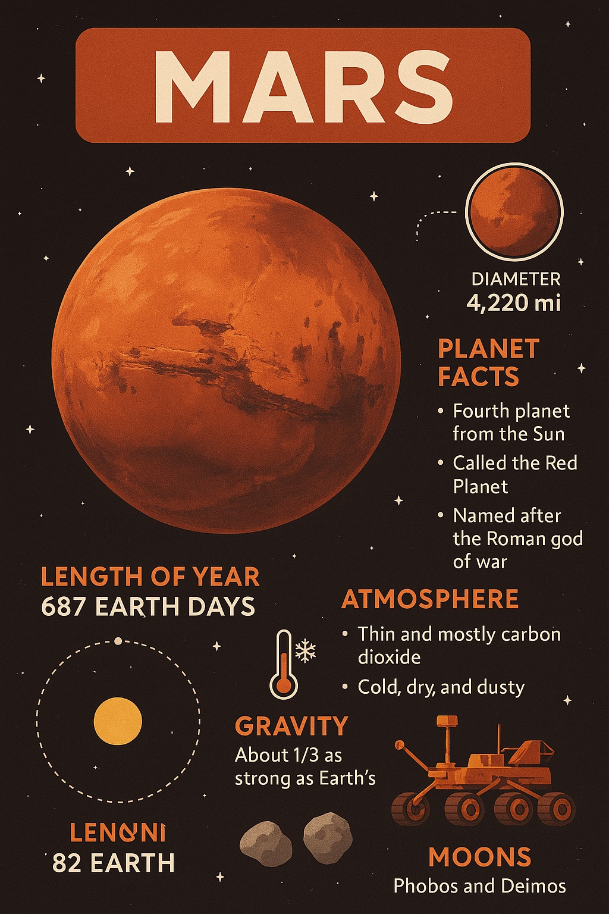

# Prompts Collection

Good read: [Introducing 4o Image Generation](https://openai.com/index/introducing-4o-image-generation/)

Prompts are sourced from various online resources.

Feel free to contribute and share your own prompts!

## Generating Ghibli-style Images

> Ghibli style

> Turn this image into a Studio Ghibli-style animated portrait. Use the soft color palette, whimsical background, and facial features inspired by Ghibli characters. Style it like a scene from 'My Neighbor Totoro' or 'Spirited Away'.

## Generating Text in Images

> Render an airbus A380 from an airline named 'AI'. The airline brand colors are: #05192D and #03EF62

## Photo Editing

> Make a pixel art charactor for this person

> Make the background transparent

> The photo was taken through a window. There are some reflections at the bottom. Remove them while keeping the rest identical.

> Reomve the people

> Make it rain

### Adding Elements to an Existing Image

> Give this cat a detective hat and a monocle

### Color Grading

> Generate a version of this image color graded with the Blade Runner 2049 style. Do not alter the image content.

## Generating Infographics and Diagrams

> Create an infographic explaining Mars

> Create a diagram explaining merge sort
